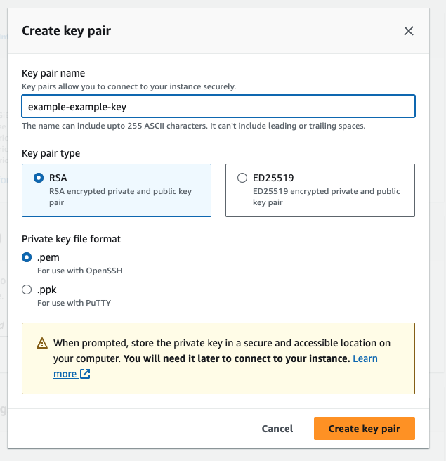

# STREAM PROCESSING TEMPLATE

## Intro

This repo is designed for you to fork and clone locally and onto your EC2 instance.

Make a note of the `.git` url for example:

> `https://github.com/<YOUR_GH_USERNAME>/stream-processing-template.git`

___

## EC2 Key-Pair

You will need a local key in order to sucessfully SSH into your EC2 once it has been built. The quickest and easiest way to do this is to sign into the AWS console - [click here.](console.aws.amazon.com/console)

Once logged in, head to the EC2 Service page. Launch a new instance, and scroll down skipping all the steps until you see the `Key pair (login)` section:


Click on `new key pair`, and you should see this popup:



Once you have given it an adequate name, and made sure to select the `.pem` version, it will download to your Downloads folder most likely. Move it to somewhere more appropriate, like the folder above this repo, or somewhere in your Projects folder - <span style="color:red">**NOT IN A REPOSITORY**</span>.

Open a terminal at that location and run the following command to make the key private:

``` bash
chmod 400 wills-example-example-keys.pem
```

Now that key will be able to be used to SSH into your EC2. The location of the key is where you should execute any SSH command that requires it's use!

```diff
- IMPORTANT!

```

``` diff
- DO NOT add your key to your repo. 
- Your key is private, and should not be in the same folder as this. 
- Please do not add your key to any repo, local or otherwise - scammers and hackers can rack up thousands 
- by scraping GitHub for keys!
```
___

## Terraform Steps

The repo provides a Terraform script for you run that will create your EC2 instance, complete with a clone of this repo (for you to run the Kafka Consumer), and all the necessary libraries.

In order to run the script, you may need to install Terraform first:
``` bash
brew install terraform
```

Once terraform has been installed, in a terminal where you can see the `main.tf` file, run the commands:
``` bash
terraform init
terraform apply
```

The script should ask you for your GitHub username, and the name of your EC2 key. If you have forked this repo, it should be set to public and your EC2 should automatically clone the contents into your instance.

> Take a look inside the [`main.tf`](./main.tf) file to see how it interpolated that information.

The script will also ask you for the name of your EC2 key. You should type the name, but without the `.pem` suffix. **For example**, when prompted, you might type in `wills-ec2-kafka-key`.

Type `yes` when it asks if you'd like to make apply the build.

Terraform will then create the EC2 instance, and after 3 minutes or so, perform the necessary commands to clone your repo and install your packages, all automatically - *the power of Terraform!*

You should have some output like this

``` bash
Apply complete! Resources: 1 added, 0 changed, 0 destroyed.

Outputs:

instance_public_ip = "xx.xx.xxx.xx"
```

That public IP address is how we will connect to that EC2 in the next step.

___

## SSH into the EC2

The final step is to SSH into your EC2 instance. Counter-intuitively, in the `ssh` command, it is always `ec2-user@...`, not your regular `aws` username.

You can do this with the following command, being sure to replace the example `your-key-name` and the `x`s with your actual key name, and your actual public EC2 ip:

``` bash
ssh -i your-key-name.pem ec2-user@x.xx.xxx.xx

```

If successful, you should see the Amazon Linux bird in ASCII and a welcome message, it looks like this:

``` 
   ,     #_
   ~\_  ####_        Amazon Linux 2
  ~~  \_#####\
  ~~     \###|       AL2 End of Life is 2025-06-30.
  ~~       \#/ ___
   ~~       V~' '->
    ~~~         /    A newer version of Amazon Linux is available!
      ~~._.   _/
         _/ _/       Amazon Linux 2023, GA and supported until 2028-03-15.
       _/m/'           https://aws.amazon.com/linux/amazon-linux-2023/

[ec2-user@ip-xxx-xx-xx-xxx ~]$ 
```

Once you have reached the step by way of SSH'ing into your EC2 instance, you should have `GIT` installed. You can check by running the command `git --version` in your EC2 shell.

You can then access the clone of your forked version of this repo onto your EC2, navigate through the `stream-processing-template/dnd_monster_examples` folder and be able to run the Kafka Consumer with `python3 monster_damage_consumer.py`.

If you start seeing some messages with `JSON` data that looks a little like this:

``` json
{"country": "United States", "population": 331073550, "monster_name": "GIANT-VULTURE", "damage": 90000, "updated_population": 330983550, "percent_loss": 0.108, "ts": "2023-10-03 14:53:14.488663"}
```

Then you're on the right track!

## Example Plotting Solutions

If you head to the [Example Plotting Folder](./example_plotting/), you will see two solutions to plot Country and Damage as they come in from the endpoint (not the stream itself). You can run these locally to see possible solutions for that simple plot, with real time data (you can decrease the polling delay from 10 seconds if you like).

Run [the Dash Consumer file](./example_plotting/dash_consumer.py) and go to your EC2 Public IP followed by port 8050 to see the results. The url you should go to will display in your terminal like this: `Dash is running on http://0.0.0.0:8050/`, you will need to replace those 0's with your Public EC2 address (the one terraform Outputs), which is viewable on AWS too.

Running the Jupyter Notebook on your EC2 will cause an error unless your EC2 is using python 3.11. It's a bit of a pain getting python 3.11 up and running with requests, which is why I reccomend using these examples locally.

Future solutions can be run in a Jupyter Notebook [(like the Plotly Example Notebook)](./example_plotting/plotly_express.ipynb), or with a dashboarding service [(like the Dash python file)](./example_plotting/dash_local_example.py).

Don't be limited by Plotly, Dash or Matplotlib - if you prefer a different plotting tool, please feel free to employ at your discretion!